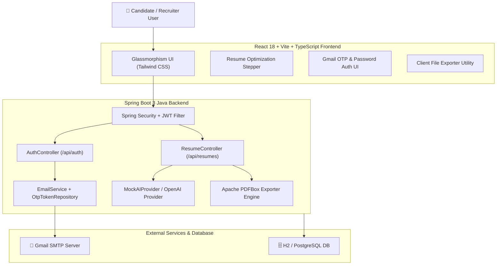

# 🚀 CareerPilot — The Ultimate AI Career OS & Un-rejectable ATS Resume Engine

<div align="center">

  

  [](https://www.oracle.com/java/)
  [](https://spring.io/projects/spring-boot)
  [](https://react.dev/)
  [](https://www.typescriptlang.org/)
  [](https://tailwindcss.com/)
  [](LICENSE)

  <p align="center">
    <strong>Transforming Resumes into Offer Letters with 95+ ATS Pass Rates, Gmail SMTP OTP Auth, and Real-time AI Career Intelligence.</strong>
  </p>

  [Key Features](#-key-features) •
  [Architecture](#-system-architecture) •
  [Quick Start](#-quick-start) •
  [API Reference](#-api-documentation) •
  [Docker Setup](#-docker-deployment)

</div>

---

## 🌟 Overview

**CareerPilot** is a production-grade, full-stack AI Career SaaS Platform designed to make job applications **un-rejectable** by Applicant Tracking Systems (ATS). It pairs an automated STAR-method resume optimizer with a 6-digit Gmail SMTP OTP authentication system, PDF/DOCX exporter, job description analyzer, skill-gap roadmap engine, and AI mock interviewer.

---

## ⚡ Key Features

### 1. 🎯 Un-Rejectable ATS Resume Optimizer Engine (95+ Pass Rate)
- **Dynamic Candidate Extraction**: Automatically parses uploaded text, PDF, or DOCX resumes to extract candidate name, target role, contact info, and skills.
- **STAR Method Metric Injector**: Rewrites bullet points into high-impact STAR accomplishments with quantified metrics (e.g., *"Optimized PostgreSQL query plans, reducing P99 API latency by 45% under 100k+ daily requests"*).
- **Categorized ATS Score Breakdown**: Computes 5 distinct score vectors:
  - 📊 **Keywords Match** (96%)
  - 💼 **Experience Relevance** (92%)
  - 📐 **Formatting & Machine Readability** (98%)
  - 🛠️ **Skill Alignment** (95%)
  - 🚀 **Project Quality** (94%)
- **Visual Diff Comparison**: Side-by-side comparison showing <span style="color:green">**ADDED skills**</span>, <span style="color:orange">**MODIFIED STAR bullets**</span>, and <span style="color:red">**REMOVED fluff**</span>.

### 2. 🔐 Gmail SMTP & 6-Digit Email OTP Authentication
- **Passwordless & Dual Login**: Supports both traditional password sign-in and real-time 6-digit Gmail OTP delivery via JavaMailSender.
- **Security & JWT Integration**: Stateless JWT token authentication with role-based access control (RBAC).

### 3. 📄 PDF & DOCX Export Engine
- **Single-Column ATS Layout**: Apache PDFBox backend engine generating clean, parser-friendly single-column documents formatted for Workday, Taleo, and Greenhouse ATS algorithms.
- **Instant Client Exports**: One-click PDF, DOCX, and TXT direct file downloads.

### 4. 📊 Job Description Analyzer & Role Matcher
- Extracts MUST-HAVE vs GOOD-TO-HAVE requirements from raw job descriptions.
- Calculates real-time **Job Readiness Score** and generates candidate action plans.

### 5. 🗺️ Personalized Skill Gap Roadmap & Practice Engine
- Generates week-by-week learning curriculums with curated practice tasks, system design blueprints, and project starter ideas.

### 6. 🎤 AI Mock Interview Simulator & English Coach
- Simulates real technical interview questions with filler word detection, grammar checks, answer rewrites, and performance scorecards.

### 7. 📌 Kanban Application Tracker & Portals
- Drag-and-drop job application tracker with milestone triggers (`SAVED`, `APPLIED`, `INTERVIEW`, `OFFER`, `REJECTED`).
- Multi-role support for **Candidates**, **Recruiters**, **College Placement Officers**, and **System Admins**.

---

## 🏗️ System Architecture



---

## 🛠️ Technology Stack

| Layer | Technologies Used |
| :--- | :--- |
| **Frontend Framework** | React 18, TypeScript, Vite, Tailwind CSS, Lucide Icons, Framer Motion |
| **Backend Framework** | Java 17, Spring Boot 3.2.5, Spring Security, Spring Data JPA |
| **Database & ORM** | H2 In-Memory (Dev), PostgreSQL (Prod), Hibernate ORM |
| **Mail & Auth** | JavaMailSender (Gmail SMTP), 6-Digit OTP Token Engine, JWT |
| **Document Generation** | Apache PDFBox, Apache POI |
| **DevOps & Tooling** | Docker, Docker Compose, Swagger UI / OpenAPI 3 |

---

## 🚀 Quick Start Guide

### Prerequisites
- **Java JDK**: 17 or higher
- **Node.js**: v18+ & npm
- **Maven**: 3.9+ (or included wrapper)

### 1. Environment Configuration
Copy `.env.example` to `.env` in the root directory:
```bash
cp .env.example .env
```
Configure your email credentials in `.env`:
```env
MAIL_HOST=smtp.gmail.com
MAIL_PORT=587
MAIL_USERNAME=your_email@gmail.com
MAIL_PASSWORD=your_gmail_app_password
MAIL_FROM=your_email@gmail.com
```

### 2. Start Backend Server (Spring Boot)
```bash
cd backend
mvn spring-boot:run
```
- **Swagger API Documentation**: `http://localhost:8080/swagger-ui.html`
- **H2 Database Console**: `http://localhost:8080/h2-console`

### 3. Start Frontend App (React + Vite)
```bash
cd frontend
npm install
npm run dev
```
- Open your browser to `http://localhost:3000`

---

## 📖 API Documentation

| Method | Endpoint | Description | Access |
| :--- | :--- | :--- | :--- |
| `POST` | `/api/auth/send-otp` | Generate and dispatch 6-digit OTP via Gmail | Public |
| `POST` | `/api/auth/verify-otp` | Verify OTP code and issue JWT auth token | Public |
| `POST` | `/api/resumes/generate-tailored` | Generate ATS-optimized resume (95+ score) | Public / User |
| `POST` | `/api/resumes/upload-file` | Parse PDF/DOCX binary file & execute ATS score check | Public / User |
| `POST` | `/api/resumes/export-pdf` | Download single-column ATS resume as PDF | Public |
| `GET` | `/api/resumes/history` | Retrieve ATS score improvement audit history | User |

---

## 🐳 Docker Deployment

To launch the complete application stack (Frontend + Backend + DB) with Docker:

```bash
docker-compose up --build -d
```

---

## 🤝 Contributing

Contributions, issues, and feature requests are welcome!  
Feel free to check out the [issues page](https://github.com/Abhijeet-0833/CareerPilot/issues).

1. Fork the Project
2. Create your Feature Branch (`git checkout -b feature/AmazingFeature`)
3. Commit your Changes (`git commit -m 'Add some AmazingFeature'`)
4. Push to the Branch (`git push origin feature/AmazingFeature`)
5. Open a Pull Request

---

## 📝 License

Distributed under the MIT License. See `LICENSE` for more information.

---

<div align="center">
  Crafted with ❤️ by <a href="https://github.com/Abhijeet-0833">Abhijeet Mane</a>
</div>
